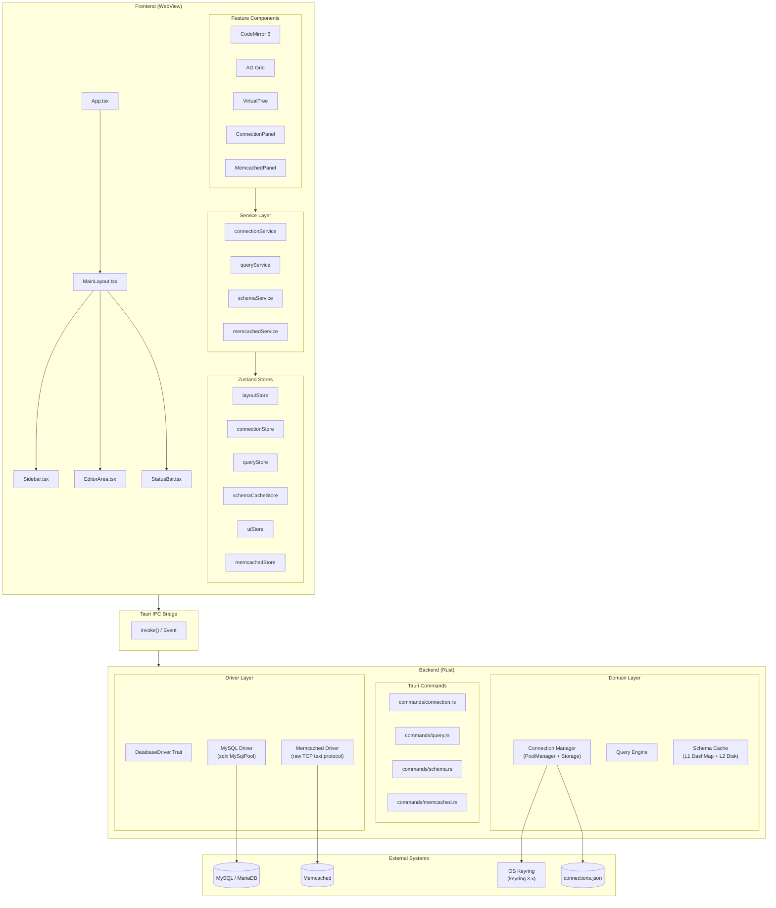
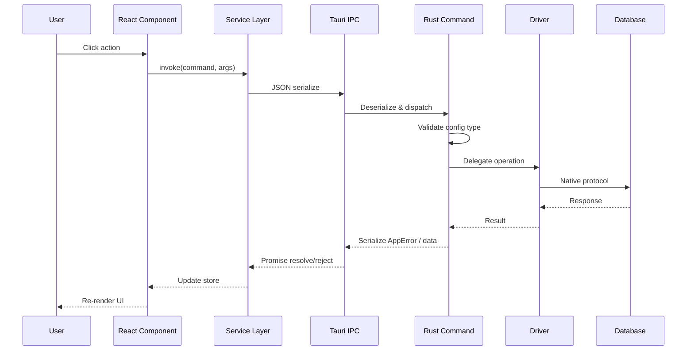
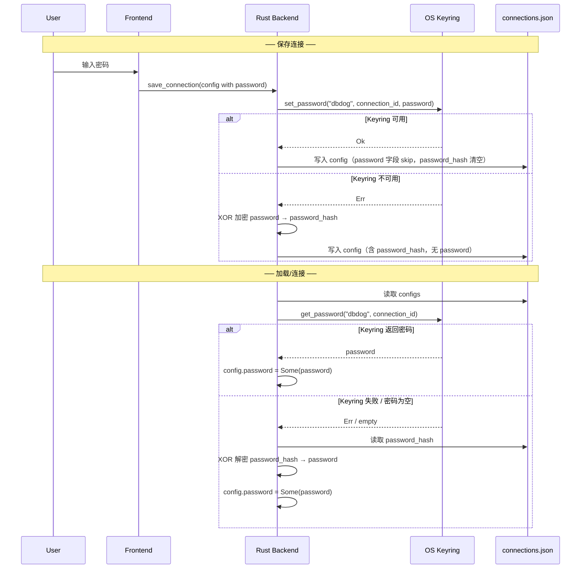
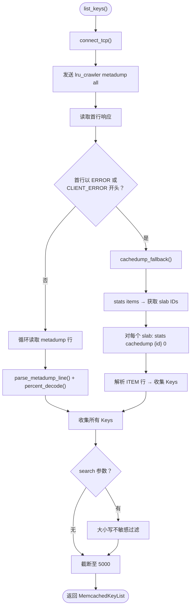

# DBDog 架构设计文档 (ADD)

> **版本**: 0.2.0
> **状态**: 草案
> **对应需求**: [REQUIREMENTS.md](./REQUIREMENTS.md)
> **架构选型**: Tauri 2.x (Rust) + React/TypeScript

---

## 1. 架构总览

DBDog 采用 **Tauri 2.x + React/TypeScript** 的桌面端分层架构：

- **Frontend (WebView)**: React 18 + TypeScript，**UI 布局参考 Beekeeper Studio**（左侧 Sidebar + 中央 Editor/Grid + 底部 StatusBar），**编码思想贯彻 VS Code 虚拟化**（一切长列表虚拟渲染、一切面板按需挂载、一切状态延迟恢复）
- **Backend (Rust)**: Tauri 命令层 + 业务领域层，负责数据库连接池、SQL 执行、本地持久化、Memcached 文本协议通信
- **Native OS**: 通过 Tauri API 与 OS 密钥链、文件系统、窗口管理交互

### 1.1 组件架构图



### 1.2 数据流时序



---

## 2. 技术栈选型

### 2.1 前端

| 类别 | 技术 | 版本 | 说明 |
|------|------|------|------|
| 框架 | React | 18.x | UI 渲染 |
| 语言 | TypeScript | 5.x | 类型安全 |
| 构建 | Vite | 5.x/6.x | Tauri 默认集成 |
| 状态管理 | Zustand | 4.x/5.x | 按领域拆分 store |
| 虚拟列表 | `@tanstack/react-virtual` | 3.x | 一切长列表虚拟化核心 |
| 路由 | TanStack Router | 1.x | 类型安全路由 |
| UI 组件 | shadcn/ui + Tailwind | 3.x | 基础组件库 |
| 编辑器 | CodeMirror 6 | 6.x | 自带 Viewport 渲染（虚拟化） |
| 数据网格 | AG Grid Community | 31.x+ | 虚拟滚动结果展示 |
| 图表 | @xyflow/react | 12.x | ER 图渲染（Phase 2+） |
| 国际化 | react-i18next | 14.x+ | 命名空间翻译 |
| SQL 格式化 | sql-formatter | 15.x+ | 编辑器美化 |

### 2.2 后端 (Rust)

| 类别 | Crate | 版本 | 说明 |
|------|-------|------|------|
| 桌面框架 | tauri | 2.x | 主进程 + IPC |
| 异步运行时 | tokio | 1.x | 异步 I/O |
| MySQL 驱动 | sqlx | 0.8.x | 异步、编译期检查 SQL |
| 连接池 | sqlx::Pool | - | 内置于 sqlx |
| Memcached 协议 | tokio::net::TcpStream | - | 原始 TCP + ASCII 文本协议 |
| 密钥链 | keyring | 3.x | 跨平台凭据存储 |
| 内存缓存 | dashmap | 6.x | 并发安全的 HashMap |
| 本地数据库 | rusqlite / sqlx | 0.32.x | 查询历史、书签持久化 |
| 序列化 | serde + serde_json | 1.x | 配置与协议序列化 |
| 错误处理 | thiserror + anyhow | 1.x / 2.x | 结构化错误 vs 泛型错误 |
| 日志 | tracing + tracing-subscriber | 0.1.x | 结构化日志 |
| 时间 | chrono | 0.4.x | 时间戳处理 |
| UUID | uuid | 1.x | 连接标识 |

---

## 3. 目录结构

```
DBDog/
├── src/                          # 前端源码 (React + TypeScript)
│   ├── main.tsx                  # 入口
│   ├── App.tsx                   # 根组件
│   ├── layout/                   # 主布局骨架（参考 Beekeeper Studio）
│   │   ├── MainLayout.tsx        # 主布局：Sidebar + Editor/Grid + StatusBar
│   │   ├── Sidebar.tsx           # 左侧边栏（连接列表 + Schema 树/Memcached 面板）
│   │   ├── EditorArea.tsx        # 中央编辑器区域（多标签 + 结果网格上下分割）
│   │   └── StatusBar.tsx         # 底部状态栏
│   ├── components/               # 通用组件
│   │   ├── ui/                   # shadcn/ui 组件
│   │   ├── virtual/              # 虚拟化组件层（VS Code 编码思想核心）
│   │   │   ├── VirtualList.tsx   # 基于 @tanstack/react-virtual 的通用虚拟列表
│   │   │   ├── VirtualTree.tsx   # 虚拟化树形组件（Schema 树）
│   │   │   └── LazyMount.tsx     # 懒加载/条件挂载包装器
│   │   ├── sidebar/              # Sidebar 内容面板
│   │   │   ├── ConnectionPanel.tsx    # 连接列表（VirtualList）
│   │   │   └── SchemaTreePanel.tsx    # Schema 树（VirtualTree）
│   │   ├── memcached/            # Memcached 专属视图 (v0.2.0+)
│   │   │   ├── MemcachedPanel.tsx     # Key 列表浏览器（VirtualList + 搜索）
│   │   │   └── MemcachedItemModal.tsx # 单个 Key 详情弹窗（值/Flags/TTL）
│   │   ├── editor/               # SQL 编辑器
│   │   │   ├── SqlEditor.tsx     # CodeMirror 6 包装
│   │   │   └── EditorTabBar.tsx  # 标签栏
│   │   ├── grid/                 # 结果网格
│   │   │   └── ResultGrid.tsx    # AG Grid 包装
│   │   ├── drawer/               # 右侧抽屉/弹窗（表结构详情）
│   │   │   └── TableStructureDrawer.tsx  # 表结构详情抽屉
│   │   ├── statusbar/            # 状态栏部件
│   │   └── command-palette/      # 命令面板（Ctrl+K）
│   ├── pages/
│   │   └── MainPage.tsx          # 入口：渲染 MainLayout
│   ├── stores/                   # Zustand Stores
│   │   ├── layoutStore.ts        # 布局状态（Sidebar 折叠、视图类型、抽屉显隐）
│   │   ├── connectionStore.ts    # 连接列表、激活连接、连接状态
│   │   ├── queryStore.ts         # 编辑器 Tabs、SQL、执行结果
│   │   ├── schemaCacheStore.ts   # Schema 树展开、搜索、选中
│   │   ├── memcachedStore.ts     # Memcached Keys、Item 详情、Server Stats (v0.2.0+)
│   │   └── uiStore.ts            # 主题、语言、全局状态
│   ├── hooks/
│   │   ├── useVirtualList.ts     # 虚拟列表 hook 封装
│   │   ├── useConnections.ts
│   │   ├── useQueryExecution.ts
│   │   ├── useSchema.ts
│   │   └── useCommandPalette.ts
│   ├── services/                 # Tauri IPC 调用封装
│   │   ├── connectionService.ts
│   │   ├── queryService.ts
│   │   ├── schemaService.ts
│   │   └── memcachedService.ts   # Memcached IPC 包装 (v0.2.0+)
│   ├── types/
│   │   └── index.ts              # 含 DatabaseType、MemcachedEntry 等类型
│   ├── locales/                  # 国际化翻译文件
│   │   ├── en/
│   │   │   ├── common.json
│   │   │   ├── connections.json
│   │   │   ├── editor.json
│   │   │   ├── query.json
│   │   │   ├── schema.json
│   │   │   ├── settings.json
│   │   │   └── memcached.json    # Memcached UI 文案 (v0.2.0+)
│   │   └── zh/
│   │       └── (同上结构)
│   └── lib/
│       ├── i18n.ts               # i18next 初始化（已注册 memcached namespace）
│       └── utils.ts
├── src-tauri/                    # Tauri / Rust 源码
│   ├── src/
│   │   ├── main.rs               # 入口，注册命令与状态
│   │   ├── lib.rs                # 模块导出（测试用）
│   │   ├── commands/             # Tauri IPC 命令处理器
│   │   │   ├── mod.rs            # 声明 connection, query, schema, memcached
│   │   │   ├── connection.rs     # 连接管理（MySQL + Memcached 路由）
│   │   │   ├── query.rs          # SQL 执行/取消
│   │   │   ├── schema.rs         # Schema 浏览/搜索
│   │   │   └── memcached.rs      # Memcached Key/Item/Stats 操作 (v0.2.0+)
│   │   ├── drivers/              # 数据库驱动抽象与实现
│   │   │   ├── mod.rs            # DatabaseDriver / DatabaseMetadata Trait
│   │   │   ├── mysql/
│   │   │   │   ├── mod.rs        # Re-export MySqlDriver
│   │   │   │   └── metadata.rs   # MySqlDriver 实现（含 connect/test/元数据查询）
│   │   │   └── memcached/        # Memcached 驱动 (v0.2.0+)
│   │   │       ├── mod.rs        # 模块声明，Re-export
│   │   │       └── protocol.rs   # MemcachedDriver: ASCII 文本协议实现
│   │   ├── connection/
│   │   │   ├── manager.rs        # PoolManager (DashMap<UUID, MySqlPool>)
│   │   │   ├── model.rs          # ConnectionConfig (含 password_hash, DatabaseType)
│   │   │   └── storage.rs        # connections.json 读写 + XOR 加密回退
│   │   ├── schema/
│   │   │   ├── cache.rs          # L1 DashMap 缓存
│   │   │   ├── disk.rs           # L2 磁盘缓存 (JSON)
│   │   │   └── model.rs          # Schema 数据结构
│   │   ├── query/
│   │   │   ├── engine.rs         # execute_query / execute_update 路由
│   │   │   ├── result.rs         # QueryResult / UpdateResult 结构
│   │   │   └── cancel.rs         # KILL QUERY 机制
│   │   ├── error.rs              # 全局错误类型 (AppError)
│   │   └── state.rs              # AppState (Tauri Managed State)
│   ├── tests/
│   │   └── memcached_integration.rs  # Memcached 集成测试 (v0.2.0+)
│   ├── migrations/
│   │   └── 001_init.sql
│   ├── Cargo.toml
│   └── Cargo.lock
├── docs/
│   ├── REQUIREMENTS.md
│   ├── CHANGELOG.md
│   └── ARCHITECTURE.md           # 本文档
└── ...
```

---

## 4. UI 设计

### 4.1 布局（参考 Beekeeper Studio）

Beekeeper Studio 风格的三栏式布局，专注于数据库工具的高效操作流：

```
┌──────────────────────────────────────────────────────────────┐
│  Toolbar                                                     │
│  [Logo]  Connection: ▼  [New Query] [Save] [Settings]        │
├──────────┬───────────────────────────────────────────────────┤
│          │  ┌─────┬─────┬─────────────────────────────────┐ │
│  Sidebar │  │ Tab1│ Tab2│  [x]                            │ │  ← Editor Tabs
│          │  ├─────┴─────┴─────────────────────────────────┤ │
│  [Conn A]│  │                                               │ │
│  [Conn B]│  │              CodeMirror 6                     │ │  ← SQL Editor
│  ▼       │  │              (Viewport Render)                │ │
│  ├ db1   │  │                                               │ │
│  │ ├ tbl│  ├───────────────────────────────────────────────┤ │
│  │ └ tbl│  │  AG Grid Community                            │ │  ← Result Grid
│  └ db2   │  │  (Virtual Scroll / Filter / Sort / Export)    │ │
│          │  │                                               │ │
│          │  └───────────────────────────────────────────────┘ │
├──────────┴───────────────────────────────────────────────────┤
│  Status Bar                                                  │
│  [MySQL 8.0] [test_db] [Rows: 1,000] [12ms] [Ln 4, Col 15] │
└──────────────────────────────────────────────────────────────┘
```

**右侧抽屉 / 弹窗**（表结构详情等以覆盖层形式打开）：

```
┌────────────────────────────────┬───────────────────────────┐
│                                │  Drawer / Modal           │
│     Main Editor Area           │  ┌─────────────────────┐  │
│     (背景遮罩)                  │  │ Table Structure     │  │
│                                │  │ - Columns           │  │
│                                │  │ - Indexes           │  │
│                                │  │ - FKs               │  │
│                                │  └─────────────────────┘  │
│                                │  ┌─────────────────────┐  │
│                                │  │ ER Diagram          │  │
│                                │  │ (@xyflow/react)     │  │
│                                │  └─────────────────────┘  │
└────────────────────────────────┴───────────────────────────┘
```

#### 布局区域说明

| 区域 | 说明 | 交互 |
|------|------|------|
| **Toolbar** | 顶部工具栏，连接切换、新建查询、保存、设置入口 | 常驻 |
| **Sidebar** | 左侧可折叠边栏，按连接类型切换视图：MySQL → Schema 树，Memcached → Key 浏览器 | 可折叠/调整宽度 |
| **Editor** | 中央上方，多标签 SQL 编辑器（CodeMirror 6） | 多 Tab，拖拽排序 |
| **Result Grid** | 中央下方，查询结果展示（AG Grid），与 Editor 上下可拖拽分割 | 与 Editor 分割比例可调 |
| **StatusBar** | 底部状态栏，连接状态、当前库、返回行数、执行耗时、光标位置 | 常驻 |
| **Drawer/Modal** | 表结构详情（右侧滑出）、Memcached Item 详情（居中弹窗） | 按需打开，关闭即卸载 |

#### Memcached 面板布局 (v0.2.0+)

连接 Memcached 实例后，Sidebar 切换至 Key 浏览器视图：

```
┌─────────────────────────────────┐
│  Sidebar: Memcached             │
│  ┌─────────────────────────────┐│
│  │ 🔍 Search keys...  [Go]    ││
│  ├─────────────────────────────┤│
│  │ 📊 Stats Bar                ││
│  │ Items: 1,234 | UP 3d 14h   ││
│  │ Memory: 256 MB | Conns: 12 ││
│  ├─────────────────────────────┤│
│  │ Key List (VirtualList)      ││
│  │ ┌─────────────────────────┐ ││
│  │ │ user:1001        [View] │ ││
│  │ │ user:1002        [Del]  │ ││
│  │ │ session:abc123    ...   │ ││
│  │ │ config:theme      ...   │ ││
│  │ └─────────────────────────┘ ││
│  ├─────────────────────────────┤│
│  │ [🔄 Refresh] [🗑 Flush All]││
│  └─────────────────────────────┘│
└─────────────────────────────────┘
```

### 4.2 虚拟化设计（VS Code 编码思想）

前端实现全面贯彻 VS Code 的虚拟化性能哲学：**视口即边界，不可见即不存在**。

#### 核心原则

1. **视口即边界**：任何超出视口的 DOM 节点不渲染，滚动时实时计算可见窗口
2. **面板按需挂载**：抽屉/弹窗关闭时从 React 树完全卸载（非 `display: none`），释放内存与事件监听
3. **状态延迟恢复**：面板重新可见时不阻塞主线程，优先渲染骨架屏，后台填充数据
4. **编辑器多 Group（未来）**：支持水平/垂直分栏，每个 Group 独立管理 Tab 与状态（VS Code 思想）

#### 虚拟化组件层

所有列表类组件统一基于 `@tanstack/react-virtual` 实现：

```typescript
// src/components/virtual/VirtualList.tsx
// 通用虚拟列表，支持固定/动态行高

interface VirtualListProps<T> {
  items: T[];
  rowHeight: number | ((item: T) => number);
  renderItem: (item: T, style: React.CSSProperties) => React.ReactNode;
  overscan?: number;        // 视口外预渲染行数（默认 5）
  scrollToIndex?: number;   // 定位到指定索引
}

// 使用场景：连接列表、历史记录、进程列表、状态变量列表、Memcached Key 列表
```

```typescript
// src/components/virtual/VirtualTree.tsx
// 虚拟化树形组件，支持展开/折叠、搜索过滤

interface VirtualTreeProps<T> {
  roots: TreeNode<T>[];
  getChildren: (node: T) => TreeNode<T>[];
  renderNode: (node: T, depth: number, style: React.CSSProperties) => React.ReactNode;
  expandedKeys: Set<string>;
  onToggle: (key: string) => void;
}

// 使用场景：Schema 树（千级数据库/万级表时的核心性能保障）
```

```typescript
// src/components/virtual/LazyMount.tsx
// 懒加载/条件挂载包装器

interface LazyMountProps {
  visible: boolean;
  keepAlive?: boolean;      // true: 首次挂载后隐藏但不卸载（类似 Vue keep-alive）
  fallback?: React.ReactNode;
  children: React.ReactNode;
}

// 使用场景：抽屉内容、设置页、Memcached Item 弹窗（大数据量时释放内存）
```

#### 各区域虚拟化策略

| UI 区域 | 组件 | 虚拟化方案 | 说明 |
|---------|------|-----------|------|
| **Sidebar - 连接列表** | `VirtualList` | 固定行高 32px | 连接数通常 < 100，但为一致性统一虚拟化 |
| **Sidebar - Schema 树** | `VirtualTree` | 动态行高 24-28px | 千级库/万级表时的核心性能保障 |
| **Sidebar - Memcached Keys** | `VirtualList` | 固定行高 36px | Key 上限 5000，分页滚动 |
| **Sidebar - 历史记录** | `VirtualList` | 固定行高 48px | 支持万级历史不卡顿 |
| **Sidebar - 书签树** | `VirtualTree` | 固定行高 28px | 文件夹 + 书签混合树 |
| **Editor - SQL 编辑器** | CodeMirror 6 | 内置 Viewport 渲染 | 百万行 SQL 仅渲染视口内行 |
| **Editor - 结果网格** | AG Grid Community | 内置虚拟滚动 | 后端截断 + 前端虚拟滚动双保险 |
| **Drawer - 进程列表** | `VirtualList` | 固定行高 32px | 实时刷新不造成 DOM 抖动 |
| **Drawer - 状态变量** | `VirtualList` | 固定行高 28px | 千级变量虚拟化 |
| **命令面板** | `VirtualList` | 固定行高 40px | 模糊搜索结果列表虚拟化 |

#### 抽屉/弹窗懒加载策略

采用严格的**条件挂载**策略，关闭时从 React 树完全移除：

```
用户打开表结构抽屉 / Memcached Item 弹窗
    │
    ▼
layoutStore / memcachedStore 标记可见
    │
    ▼
组件挂载 ──► 渲染骨架屏 ──► 异步请求数据
    │
    ▼
数据到达 ──► 渲染内容 ──► 用户可交互
    │
    ▼
用户点击关闭或点击遮罩
    │
    ▼
组件完全卸载（组件 destroy，释放内存）
```

对于需要保持状态的场景（如表结构抽屉中的滚动位置），使用 `keepAlive` 模式。

#### 编辑器多 Group 分栏（VS Code 思想，未来扩展）

中央编辑器区域预留分栏扩展能力：

- 支持多个 `EditorGroup`，可水平/垂直分割
- 每个 Group 独立维护 Tab 列表、当前激活 Tab、滚动位置
- 拖拽 Tab 可在 Group 之间移动，或新建 Group
- 分栏状态持久化到 `layoutStore`，重启后恢复

```typescript
// stores/layoutStore.ts

interface EditorGroup {
  id: string;
  tabs: QueryTab[];
  activeTabId: string;
}

interface LayoutState {
  // 分栏布局（未来扩展）
  groups: EditorGroup[];
  activeGroupId: string;
  splitDirection: 'horizontal' | 'vertical';

  // 可见性控制
  sidebarVisible: boolean;
  sidebarWidth: number;
  sidebarView: 'connection' | 'schema' | 'memcached';  // v0.2.0: 新增 memcached

  // 抽屉
  drawer: {
    type: 'tableStructure' | null;
    params?: Record<string, unknown>;
  };
}
```

---

## 5. 核心模块设计

### 5.1 连接管理 (Connection Management)

#### 连接类型

`ConnectionConfig.db_type` 枚举：

```rust
#[derive(Debug, Clone, Copy, Serialize, Deserialize, PartialEq, Eq)]
#[serde(rename_all = "lowercase")]
pub enum DatabaseType {
    Mysql,
    Memcached,  // v0.2.0+
}
```

连接时根据 `db_type` 路由到对应驱动：MySQL → `MySqlDriver::connect()`；Memcached → TCP "version" 命令探测。

#### 状态机

```
[disconnected] -- Connect --> [connecting] -- success --> [connected]
                                            -- failure --> [error]
[connected] -- Disconnect --> [disconnected]
[error] -- Retry / Edit --> [connecting]
```

#### PoolManager

- 使用 `DashMap<Uuid, MySqlPool>` 存储活跃 MySQL 连接池
- 同一 UUID 重复 `Connect` 时幂等：若池中已存在且未关闭，直接返回
- `Disconnect` 时从 DashMap 移除并调用 `pool.close()`
- Memcached 连接**不维护长连接池**：每次操作创建独立 TCP 连接，操作完成后关闭

#### 密码持久化

密码存储采用 **双源机制**：OS 密钥链为主，XOR 加密回退为辅。



**实现细节：**

- `ConnectionConfig.password` 字段使用 `#[serde(skip_serializing)]`，**永不写入** `connections.json`
- `ConnectionConfig.password_hash` 字段使用 `#[serde(skip_serializing_if = "Option::is_none")]`，仅在 keyring 不可用时写入
- XOR 密钥 = `connection_id.to_string()`（UUID），非密码学安全但防止明文泄露
- 加密函数 `xor_encrypt(input, key)` 输出 hex 字符串
- 解密函数 `xor_decrypt(hex_input, key)` 逆向恢复
- 保存时：keyring 成功则清空 `password_hash`；keyring 失败则计算并存储 `password_hash`
- 加载时：优先 keyring → 回退 XOR 解密 `password_hash`

### 5.2 驱动抽象 (Driver Trait)

```rust
// src-tauri/src/drivers/mod.rs

#[async_trait]
pub trait DatabaseDriver: Send + Sync {
    async fn test(&self, config: &ConnectionConfig) -> Result<String, AppError>;
    async fn connect(&self, config: &ConnectionConfig) -> Result<Pool, AppError>;
    async fn execute_query(&self, pool: &Pool, sql: &str, limit: u32) -> Result<QueryResult, AppError>;
    async fn execute_update(&self, pool: &Pool, sql: &str) -> Result<UpdateResult, AppError>;
    async fn cancel_query(&self, pool: &Pool, thread_id: u64) -> Result<(), AppError>;
}

#[async_trait]
pub trait DatabaseMetadata: Send + Sync {
    async fn fetch_databases(&self, pool: &Pool) -> Result<Vec<Database>, AppError>;
    async fn fetch_tables(&self, pool: &Pool, db: &str) -> Result<Vec<Table>, AppError>;
    async fn fetch_columns(&self, pool: &Pool, db: &str, table: &str) -> Result<Vec<Column>, AppError>;
    async fn fetch_indexes(&self, pool: &Pool, db: &str, table: &str) -> Result<Vec<Index>, AppError>;
    async fn fetch_foreign_keys(&self, pool: &Pool, db: &str, table: &str) -> Result<Vec<ForeignKey>, AppError>;
    async fn fetch_triggers(&self, pool: &Pool, db: &str, table: &str) -> Result<Vec<Trigger>, AppError>;
    async fn fetch_create_table(&self, pool: &Pool, db: &str, table: &str) -> Result<String, AppError>;
}

#[async_trait]
pub trait DatabaseHealth: Send + Sync {
    async fn process_list(&self, pool: &Pool) -> Result<Vec<Process>, AppError>;
    async fn kill_process(&self, pool: &Pool, id: u64) -> Result<(), AppError>;
    async fn status_variables(&self, pool: &Pool) -> Result<Vec<StatusVar>, AppError>;
    async fn global_variables(&self, pool: &Pool) -> Result<Vec<Variable>, AppError>;
    async fn innodb_status(&self, pool: &Pool) -> Result<InnodbStatus, AppError>;
}
```

**设计说明：** `DatabaseDriver` / `DatabaseMetadata` / `DatabaseHealth` 三个 Trait 定义的操作以 SQL 关系型数据库为模型。Memcached 作为 KV 缓存，语义不同，**不实现这些 Trait**，而是通过 `MemcachedDriver` 的独立静态方法提供服务。这避免了为了满足 Trait 接口而添加无意义的空实现或错误返回。未来若有更多 KV 类型后端，可考虑新增专门的 KV Trait（如 `DatabaseKeyValue`）。

#### 扩展新数据库

新增数据库后端仅需三步：
1. 在 `src-tauri/src/drivers/` 下新建目录，实现对应 Trait（关系型）或独立 Driver（KV 型）
2. 在 `commands/connection.rs` 的 `test_connection` / `connect` 中按 `DatabaseType` 添加路由分支
3. 前端连接对话框增加新数据库类型选项（`ConnectionFormModal.tsx` 中的 type selector）

### 5.3 Memcached 驱动 (v0.2.0+)

#### 架构

`MemcachedDriver` 位于 `src-tauri/src/drivers/memcached/protocol.rs`，是一个**无状态结构体**，所有方法均为静态异步方法。每次操作创建独立 TCP 连接，完成即关闭——不维护连接池。

```rust
pub struct MemcachedDriver;

impl MemcachedDriver {
    pub async fn test(config: &ConnectionConfig) -> Result<String, AppError>;
    pub async fn list_keys(config: &ConnectionConfig, search: Option<&str>) -> Result<MemcachedKeyList, AppError>;
    pub async fn get_item(config: &ConnectionConfig, key: &str) -> Result<MemcachedEntry, AppError>;
    pub async fn delete_item(config: &ConnectionConfig, key: &str) -> Result<(), AppError>;
    pub async fn flush_all(config: &ConnectionConfig) -> Result<(), AppError>;
    pub async fn get_stats(config: &ConnectionConfig) -> Result<MemcachedServerInfo, AppError>;
}
```

#### 数据结构

```rust
#[derive(Debug, Clone, Serialize)]
#[serde(rename_all = "camelCase")]
pub struct MemcachedEntry {
    pub key: String,
    pub flags: u32,
    pub size_bytes: u64,
    pub expiration: Option<i64>,  // None = no expiration
    pub value: Option<String>,
}

#[derive(Debug, Clone, Serialize)]
#[serde(rename_all = "camelCase")]
pub struct MemcachedKeyList {
    pub total_keys: usize,
    pub keys: Vec<String>,
    pub truncated: bool,  // true if > 5000 keys
}

#[derive(Debug, Clone, Serialize)]
#[serde(rename_all = "camelCase")]
pub struct MemcachedServerInfo {
    pub version: String,       // e.g. "1.6.21"
    pub uptime: String,        // e.g. "1234567"
    pub curr_items: String,    // current item count
    pub total_items: String,   // items stored since start
    pub bytes: String,         // current bytes used
    pub limit_maxbytes: String,
    pub curr_connections: String,
    pub total_connections: String,
    pub get_hits: String,
    pub get_misses: String,
    pub evictions: String,
}
```

#### 文本协议实现

MemcachedDriver 通过 `tokio::net::TcpStream` 直接收发 ASCII 文本协议命令，不依赖任何第三方 Memcached 客户端库。

**内部连接辅助：**

- `connect_tcp(config)` — 根据 `host:port` 建立 `TcpStream`
- `split_stream(stream)` — 将 TcpStream 拆分为 `BufReader<ReadHalf>` 和 `BufWriter<WriteHalf>`，实现读写分离

**命令映射：**

| 操作 | Memcached 命令 | 响应解析 |
|------|---------------|---------|
| `test` | `stats` | 解析 `STAT version` 行 |
| `get_item` | `get <key>\r\n` | 解析 `VALUE <key> <flags> <bytes>` 行 + 数据块 + `END` |
| `delete_item` | `delete <key>\r\n` | 匹配 `DELETED` / `NOT_FOUND` |
| `flush_all` | `flush_all\r\n` | 匹配 `OK` |
| `get_stats` | `stats` | 逐行 `STAT <name> <value>` 解析至 `END` |

#### Key 列表获取策略



**两种策略详解：**

1. **`lru_crawler metadump all`（优先）** — 要求 Memcached 启用 `lru_crawler`（默认开启于 1.4.x+）。返回格式：
   ```
   key=user%3A1001 exp=-1 la=12345 ...
   key=session%3Aabc exp=1712345678 la=67890 ...
   END
   ```

2. **`stats cachedump`（回退）** — 旧版 Memcached 或无 `lru_crawler` 时的降级方案：
   - 先 `stats items` 获取所有 slab ID
   - 对每个 slab 执行 `stats cachedump <id> 0`
   - 解析 `ITEM <key>` 行

#### 百分号编码处理

`lru_crawler metadump all` 对 Key 进行了**双重百分号编码**：
- 原始 Key `user:1001` → 单重编码 `user%3A1001` → 双重编码 `user%253A1001`

`percent_decode()` 函数执行**恰好一轮解码**：
```
输入:  user%253A1001  →  解码一次:  user%3A1001
```

注意：最终 Key 仍含百分号（`%3A` 解码后为 `:`），这是 Memcached 内部存储格式。
`stats cachedump` 返回的 ITEM 行不经过编码，原样使用。

#### IPC 命令

| 命令 | 前端调用 | Rust Handler |
|------|---------|-------------|
| `memcached_list_keys` | `memcachedService.listKeys(connId, search?)` | `memcached_list_keys` → `MemcachedDriver::list_keys()` |
| `memcached_get_item` | `memcachedService.getItem(connId, key)` | `memcached_get_item` → `MemcachedDriver::get_item()` |
| `memcached_delete_item` | `memcachedService.deleteItem(connId, key)` | `memcached_delete_item` → `MemcachedDriver::delete_item()` |
| `memcached_flush_all` | `memcachedService.flushAll(connId)` | `memcached_flush_all` → `MemcachedDriver::flush_all()` |
| `memcached_get_stats` | `memcachedService.getStats(connId)` | `memcached_get_stats` → `MemcachedDriver::get_stats()` |

所有命令在执行前验证 `config.db_type == DatabaseType::Memcached`，非 Memcached 连接返回 `DriverNotSupported` 错误。

### 5.4 Schema 缓存系统

#### 分层缓存

```
┌─────────────────────────────────────────┐
│              L1 内存缓存                 │
│    DashMap<CacheKey, CachedValue>       │
│    TTL: 5 min, 进程级共享                │
│                                         │
│    CacheKey = (connection_uuid, db,     │
│                 object_type, object_name)│
└─────────────────────────────────────────┘
                    │  miss
                    ▼
┌─────────────────────────────────────────┐
│              L2 磁盘缓存                 │
│    {app_data}/schema_cache/{conn_id}/   │
│    TTL: 1 hour                          │
│                                         │
│    文件: {db}_{type}_{name}.json        │
│    含 `cached_at` 时间戳                 │
└─────────────────────────────────────────┘
                    │  miss / expired
                    ▼
┌─────────────────────────────────────────┐
│              数据库查询                   │
│    通过 DatabaseMetadata Trait 实时获取  │
│    写入 L1 + L2                         │
└─────────────────────────────────────────┘
```

> Schema 缓存系统仅适用于 MySQL 连接。Memcached 无 Schema 概念，不参与缓存。

#### 缓存失效策略

| 触发条件 | 行为 |
|----------|------|
| 执行 DDL (CREATE/ALTER/DROP/RENAME/TRUNCATE) | 按 connection_uuid 精确失效对应连接的 L1 + L2 |
| 用户手动刷新 | 按库级别失效 |
| TTL 到期 | 首次访问时懒加载，后台不主动清理 |
| 应用启动 Connect | L2 数据自动预热到 L1 |

### 5.5 查询执行引擎

#### 执行路由

```
用户点击执行
    │
    ▼
前端分析 SQL 类型（首词匹配）
    │
    ├── SELECT / SHOW / EXPLAIN ──► invoke("execute_query")
    │                                 返回 QueryResult {
    │                                   columns: Vec<ColumnMeta>,
    │                                   rows: Vec<Vec<serde_json::Value>>,
    │                                   total_count: u64,
    │                                   truncated: bool,
    │                                   elapsed_ms: u64
    │                                 }
    │
    └── INSERT / UPDATE / DELETE / DDL ──► invoke("execute_update")
                                          返回 UpdateResult {
                                            rows_affected: u64,
                                            last_insert_id: Option<u64>,
                                            elapsed_ms: u64
                                          }
```

> 查询执行引擎仅适用于 MySQL 连接。Memcached 无 SQL 查询能力。

#### 查询取消机制

```
前端点击 Cancel
    │
    ▼
invoke("cancel_query", { connection_id, thread_id })
    │
    ▼
Rust 端执行独立的 KILL QUERY <thread_id>
    │
    ▼
原查询 sqlx 执行返回错误 (MySqlError: query interrupted)
    │
    ▼
前端捕获错误，状态标记为 cancelled
```

### 5.6 本地持久化 (SQLite)

#### 数据库文件

- 位置: `{app_data}/dbdog.db`
- 通过 `rusqlite` 或 `sqlx::SqlitePool` 访问
- 启动时自动执行 `migrations/` 下按版本排序的 SQL 脚本

#### 核心表结构（概要）

Phase 1 不依赖本地 SQLite 持久化（无历史记录、无书签）。未来 Phase 2+ 扩展时按需添加。

```sql
-- Phase 1 暂无本地表
-- Phase 2+ 将添加：query_history, bookmarks, bookmark_folders
```

---

## 6. 前端状态管理 (Zustand)

按领域拆分为多个独立 Store，避免单 Store 膨胀：

| Store | 职责 | 持久化 |
|-------|------|--------|
| `layoutStore` | 布局状态（Sidebar 折叠、视图类型 `connection/schema/memcached`、抽屉显隐、分栏、尺寸） | 是（localStorage） |
| `connectionStore` | 连接列表、当前激活连接、连接状态 | 否（源数据来自 Rust） |
| `queryStore` | 各 Group 的 Tab 列表、SQL 文本、执行结果 | 否（内存级） |
| `schemaCacheStore` | Schema 树展开节点、搜索关键词、选中节点 | 否 |
| `memcachedStore` | Memcached Key 列表、Item 详情、Server Stats、搜索与加载状态 (v0.2.0+) | 否 |
| `uiStore` | 主题、语言、命令面板显隐、全局 Loading | 是（localStorage） |

### Memcached Store (v0.2.0+)

```typescript
// stores/memcachedStore.ts

interface MemcachedState {
  // Key list
  keys: string[];
  totalKeys: number;
  truncated: boolean;
  isLoadingKeys: boolean;

  // Item detail
  selectedKey: string | null;
  selectedItem: MemcachedEntry | null;
  isLoadingItem: boolean;

  // Server info
  serverInfo: MemcachedServerInfo | null;
  isLoadingStats: boolean;

  // Search
  searchQuery: string;

  // Actions
  listKeys: (connectionId: string, search?: string) => Promise<void>;
  loadItem: (connectionId: string, key: string) => Promise<void>;
  deleteItem: (connectionId: string, key: string) => Promise<void>;
  flushAll: (connectionId: string) => Promise<void>;
  loadStats: (connectionId: string) => Promise<void>;
  clearSelection: () => void;
  setSearchQuery: (query: string) => void;
}
```

### 状态流示例：执行查询

```
用户点击执行
    │
    ▼
queryStore.setTabExecuting(groupId, tabId, true)
    │
    ▼
queryService.execute(sql, connectionId, limit)
    │
    ▼
Tauri IPC ──► Rust 后端
    │
    ▼
queryStore.setTabResult(groupId, tabId, result)
queryStore.setTabExecuting(groupId, tabId, false)
    │
    ▼
// Phase 1 无历史记录功能，查询结果直接展示在 Tab 中
```

### 状态流示例：浏览 Memcached Keys

```
用户双击 Memcached 连接
    │
    ▼
connectionStore 设置激活连接
layoutStore.setSidebarView('memcached')
    │
    ▼
MemcachedPanel 挂载 → memcachedStore.listKeys(connectionId)
    │
    ▼
memcachedService.listKeys(connectionId) → Tauri IPC
    │
    ▼
memcachedStore 设置 keys[], serverInfo（并行 stats 请求）
    │
    ▼
MemcachedPanel 渲染 VirtualList + Stats Bar
    │
    ▼
用户点击某个 Key → memcachedStore.loadItem(connectionId, key)
    │
    ▼
MemcachedItemModal 挂载 → 渲染 Flags / TTL / Value
```

---

## 7. 数据流与 IPC 设计

### 7.1 IPC 命令清单

| 命名空间 | 命令 | 输入 | 输出 |
|----------|------|------|------|
| `connection` | `list_connections` | - | `Vec<ConnectionConfig>` |
| `connection` | `save_connection` | `ConnectionConfig` | `ConnectionConfig` |
| `connection` | `delete_connection` | `id: Uuid` | `()` |
| `connection` | `test_connection` | `ConnectionConfig` | `version: String` |
| `connection` | `connect` | `id: Uuid, password?: String` | `ServerInfo` |
| `connection` | `disconnect` | `id: Uuid` | `()` |
| `query` | `execute_query` | `connection_id, sql, limit` | `QueryResult` |
| `query` | `execute_update` | `connection_id, sql` | `UpdateResult` |
| `query` | `cancel_query` | `connection_id, thread_id` | `()` |
| `query` | `explain_query` | `connection_id, sql` | `ExplainResult` |
| `schema` | `get_databases` | `connection_id` | `Vec<Database>` |
| `schema` | `get_tables` | `connection_id, db` | `Vec<Table>` |
| `schema` | `get_table_details` | `connection_id, db, table` | `TableDetails` |
| `schema` | `refresh_schema` | `connection_id, db?` | `()` |
| `schema` | `search_schema` | `connection_id, keyword` | `Vec<SearchResult>` |
| `memcached` | `memcached_list_keys` | `connection_id, search?` | `MemcachedKeyList` |
| `memcached` | `memcached_get_item` | `connection_id, key` | `MemcachedEntry` |
| `memcached` | `memcached_delete_item` | `connection_id, key` | `()` |
| `memcached` | `memcached_flush_all` | `connection_id` | `()` |
| `memcached` | `memcached_get_stats` | `connection_id` | `MemcachedServerInfo` |

### 7.2 事件（前端订阅）

Tauri `Event` 用于后端主动推送到前端：

| 事件名 | 触发场景 | 载荷 |
|--------|----------|------|
| `schema:changed` | 执行 DDL 后 | `{ connection_id, database }` |
| `connection:status` | 连接状态变更 | `{ connection_id, status }` |

---

## 8. 安全设计

### 8.1 密码零明文

密码持久化采用 **keyring 优先 + XOR 加密回退** 机制（详见 [5.1 密码持久化](#密码持久化)）。

核心原则：
- 密码字段在 `ConnectionConfig` 中使用 `#[serde(skip_serializing)]`，**永不写入** `connections.json`
- 读取配置时，优先通过 `keyring::get_password(service, username)` 从 OS 密钥链取回
- keyring 不可用时，从 `password_hash` 字段 XOR 解密恢复（使用 `connection_id` 作为密钥）
- 日志中任何 `Debug` 输出需手动屏蔽密码字段
- 前端密码输入后直接通过 IPC 传递，不进入 React state 持久化

### 8.2 SQL 注入防护

- **后端**: 所有动态查询均使用 sqlx 参数化查询，禁止字符串拼接 SQL
- **前端**: 用户输入的 SQL 直接透传给 `execute_query` / `execute_update`，不做解析或改写（除 `EXPLAIN` 前缀追加外）
- **Memcached**: 文本协议命令中 Key 直接嵌入命令字符串，但 Memcached 协议本身不执行任意命令——Key 仅作为数据标识符，无注入风险

### 8.3 AG Grid 许可合规

- 仅引入 `ag-grid-community`，不安装 `ag-grid-enterprise`
- 禁用所有 Enterprise 特性：Server-Side Row Model、Row Grouping、Advanced Filter 等
- 功能开关统一在 `GridOptions` 中显式声明为 Community 级别

---

## 9. 性能策略

### 9.1 前端虚拟化性能

| 场景 | 策略 |
|------|------|
| Schema 树（万级节点） | `VirtualTree` 仅渲染视口内节点，展开/折叠仅更新可见窗口 |
| 历史记录（万级条目） | `VirtualList` + 分页加载，滚动到底部时自动加载下一页 |
| Memcached Key 列表（5000 cap） | `VirtualList` + 固定行高，前端分页搜索 |
| 进程列表（实时刷新） | `VirtualList` + `overscan=3`，数据更新时仅重渲染变更行（key 稳定） |
| 结果网格（百万级后端截断） | AG Grid 虚拟滚动 + 后端默认 limit=1000，前端无压力 |
| 表结构抽屉 | `LazyMount` 关闭即卸载，保持内存干净 |
| Memcached Item 弹窗 | `LazyMount` 关闭即卸载，Value 截断至 2KB 展示 |
| 命令面板（千级命令） | `VirtualList` 模糊搜索后虚拟渲染匹配结果 |
| 面板切换 | `LazyMount` 默认完全卸载，需要保状态的用 `keepAlive` |
| 编辑器分栏 | 关闭 Group 时所有 Tab 组件卸载，释放 CodeMirror 实例 |

### 9.2 大结果集处理

| 场景 | 策略 |
|------|------|
| 查询返回 > limit (默认 1000) | 后端截断，标记 `truncated = true`，仅传输 limit 行到前端 |
| AG Grid 渲染 | 虚拟滚动，DOM 仅渲染视口内行 |
| 导出大结果集 | 后端流式写入文件，前端下载，不走内存全量加载 |
| 前端结果存储 | 使用 Zustand 存储 JSON 数组，超过 10 万行时建议用户导出而非展示 |
| Memcached Key 列表 | 后端硬截断至 5000，`truncated` 标记通知前端 |

### 9.3 Schema 加载优化

- Connect 成功后异步预热 Schema（不阻塞 UI）
- 树形导航采用懒加载：展开数据库节点时才请求表列表
- L1 缓存命中时，千级表展开 < 100ms

### 9.4 Memcached 性能考量

- **无连接池**：每次操作建立短 TCP 连接，适合偶尔操作的场景。频繁操作时考虑未来引入连接缓存
- **Key 列表 5000 上限**：避免大实例（百万 Key）阻塞 UI 和占用内存
- **并行 stats + list_keys**：`MemcachedPanel` 挂载时并行发起 `listKeys` 和 `getStats` 请求
- **搜索客户端过滤**：前端输入搜索词时重新调用 `list_keys(search)`，后端 case-insensitive 过滤

### 9.5 启动优化

- Vite 代码分割：按路由/功能懒加载组件
- Tauri 启用 `withGlobalTauri: false`，按需注入 API
- SQLite 迁移脚本版本化，仅执行未应用的迁移
- 布局状态从 localStorage 恢复，优先渲染骨架屏

---

## 10. 错误处理规范

### 10.1 Rust 后端

```rust
// src-tauri/src/error.rs

#[derive(Debug, thiserror::Error, serde::Serialize)]
pub enum AppError {
    #[error("数据库连接失败: {0}")]
    ConnectionFailed(String),
    #[error("SQL 执行错误: {0}")]
    QueryFailed(String),
    #[error("查询已取消")]
    QueryCancelled,
    #[error("Schema 缓存未命中")]
    SchemaCacheMiss,
    #[error("密钥链操作失败: {0}")]
    KeyringError(String),
    #[error("配置读写失败: {0}")]
    ConfigError(String),
    #[error("连接不存在: {0}")]
    ConnectionNotFound(String),
    #[error("驱动不支持此操作: {0}")]
    DriverNotSupported(String),
    #[error("Key 不存在: {0}")]
    KeyNotFound(String),
    #[error("Memcached 协议错误: {0}")]
    MemcachedProtocolError(String),
    #[error("未知错误: {0}")]
    Unknown(String),
}

impl serde::Serialize for AppError {
    fn serialize<S>(&self, serializer: S) -> Result<S::Ok, S::Error>
    where S: serde::Serializer {
        serializer.serialize_str(self.to_string().as_ref())
    }
}
```

新增错误变体（v0.2.0）：
- `ConnectionNotFound` — 按 UUID 查找连接时未找到
- `DriverNotSupported` — Memcached 连接被用于 SQL 操作（或反之）
- `KeyNotFound` — Memcached `get` / `delete` 的 Key 不存在
- `MemcachedProtocolError` — Memcached 文本协议响应解析失败

### 10.2 前端错误边界

- React Error Boundary 包裹 `EditorArea` 和 `Sidebar`，防止单区域崩溃影响全局
- 查询执行错误在 Tab 内展示，不影响其他 Group/Tab
- Memcached 操作错误在对应面板内展示 toast 通知
- 跨 Store 错误通过 `toastStore` 统一通知用户

---

## 11. 国际化 (i18n)

### 命名空间设计

```
src/locales/
├── en/
│   ├── common.json       # 通用词汇 (保存、取消、删除...)
│   ├── connections.json  # 连接管理
│   ├── editor.json       # SQL 编辑器
│   ├── query.json        # 查询结果、执行
│   ├── schema.json       # Schema 浏览器
│   ├── settings.json     # 设置
│   └── memcached.json    # Memcached UI (v0.2.0+)
└── zh/  (同上结构)
```

### Memcached 命名空间 (v0.2.0+)

`memcached.json` 包含以下翻译 Key：

| Key | 说明 |
|-----|------|
| `title` | 面板标题 "Memcached" |
| `searchPlaceholder` | 搜索框占位符 |
| `search` | 搜索按钮 |
| `refresh` / `flushAll` | 操作按钮 |
| `backToConnections` | 返回连接列表 |
| `loadingKeys` / `noKeys` / `noMatchingKeys` / `truncated` | 列表状态提示 |
| `items` / `uptime` / `memory` / `connections` | Stats Bar 标签 |
| `viewItem` / `deleteItem` | Key 行操作 |
| `confirmDelete` / `confirmFlushAll` | 危险操作确认 |
| `deleteSuccess` / `flushSuccess` | 成功提示 |
| `key` / `flags` / `size` / `expiration` / `value` | Item 详情字段 |
| `valueTruncated` / `empty` / `never` | Item 值展示状态 |
| `notFound` / `loading` / `dismiss` | 弹窗状态 |

### 初始化

```typescript
// src/lib/i18n.ts
import enMemcached from "../locales/en/memcached.json";
import zhMemcached from "../locales/zh/memcached.json";

const resources = {
  en: { common, connections, editor, query, schema, settings, memcached: enMemcached },
  zh: { common, connections, editor, query, schema, settings, memcached: zhMemcached },
};
```

- 后端错误消息统一返回英文，前端按 `error.code` 映射到本地化文案
- 日期时间存储 RFC3339，前端 `Intl.DateTimeFormat` 按 locale 渲染

---

## 12. 测试策略

| 层级 | 范围 | 工具 | 文件 |
|------|------|------|------|
| 单元测试 | Rust Driver Trait 实现、缓存逻辑、工具函数 | `cargo test` | 内联 `#[cfg(test)]` |
| 集成测试 | Tauri command 端到端、Memcached 协议交互 | `cargo test` | `src-tauri/tests/memcached_integration.rs` |
| 前端组件测试 | React 组件渲染与交互 | Vitest + React Testing Library | `*.spec.tsx` |
| E2E 测试 | 完整用户流程（连接 → 查询 → 导出） | Playwright / WebdriverIO | - |

### Memcached 集成测试 (v0.2.0+)

`src-tauri/tests/memcached_integration.rs` 包含以下测试用例（需要本地 Memcached 实例 `127.0.0.1:11211`）：

- `test_connection` — 验证 `MemcachedDriver::test()` 返回版本字符串
- `get_stats` — 验证 `stats` 命令解析 server info
- `list_keys` — 验证 `lru_crawler metadump` 路径
- `search_keys` — 验证 `search` 参数过滤
- `get_item` — 验证 `get` 命令完整 VALUE 解析
- `missing_key_error` — 验证不存在的 Key 返回 `KeyNotFound`
- `delete_error` — 验证 delete 不存在的 Key 返回 `KeyNotFound`

---

## 13. 演进路线

| 阶段 | 架构变化 |
|------|----------|
| **Phase 1 (MySQL)** | 当前架构完全适用，MySQL Driver 作为 Trait 唯一实现。完成连接管理、SQL 执行、Schema 缓存、本地持久化基础。 |
| **Phase 2 (Memcached) v0.2.0** | ✅ 已实现。新增 `MemcachedDriver`（独立静态方法，不实现 `DatabaseDriver` Trait）；前端新增 Memcached Key-Value 专属视图组件（MemcachedPanel / MemcachedItemModal）；密码持久化升级为 keyring + XOR 双源机制。验证了驱动层对非关系型后端的可扩展性。 |
| **Phase 3 (Redis/ZK)** | 新增 `RedisDriver` 实现，Redis 丰富数据类型（String/Hash/List/Set/ZSet/Stream）需要更复杂的前端组件；评估是否需要新增 KV Trait（如 `DatabaseKeyValue`）统一 KV 后端的契约。MemcachedDriver 届时可迁移至统一 Trait。 |
| **未来 (插件系统)** | Driver 动态加载：Rust 侧支持动态库 (.so/.dll/.dylib) 注册，或 WASM 插件沙箱 |
